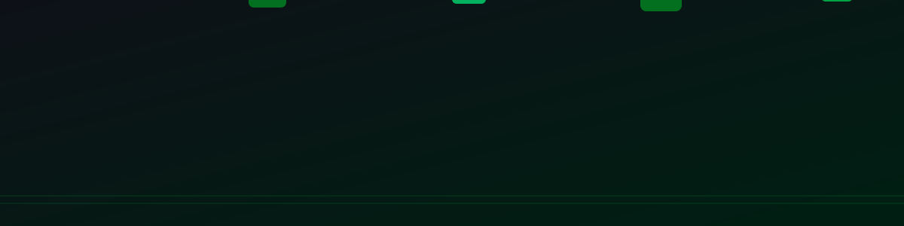
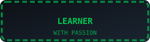
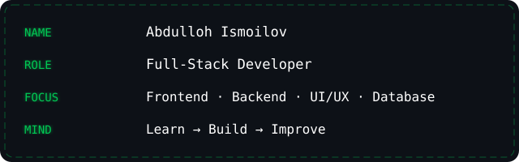
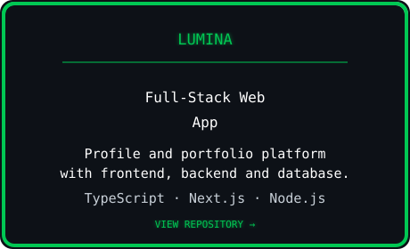
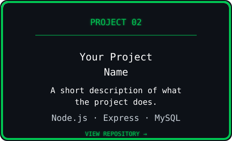
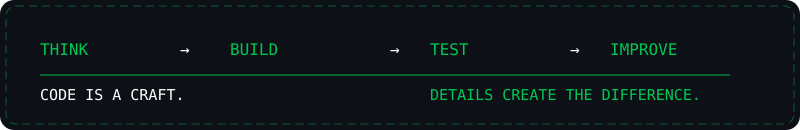

  

 

 

 

 

&nbsp;

&nbsp;

---

  

 

  

 
I build modern web applications with a focus on clean UI, real functionality, and efficient data handling.

---

  

 

  

---

  

 

  

---

  

 

  

---

  

  

&nbsp;

---

  

---

  

