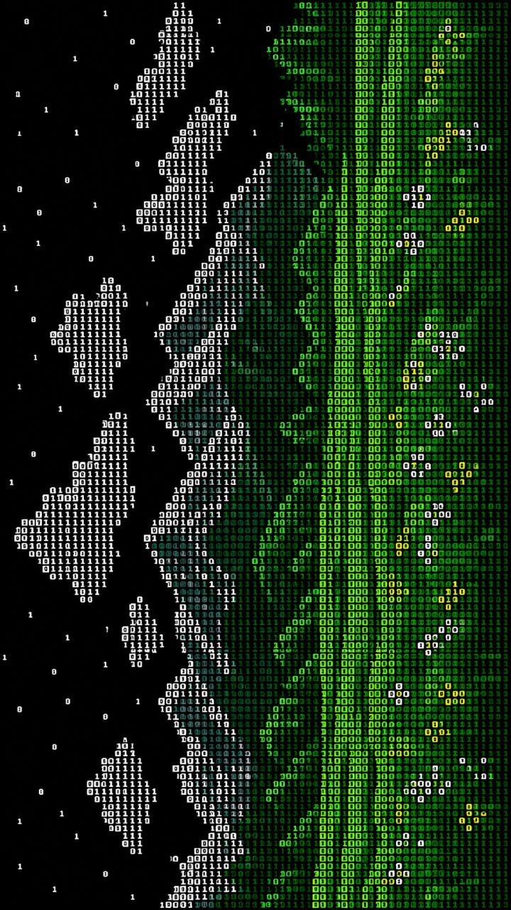

<p align="center">
  
</p>

<div align="center">



<br>

<!-- Avatar + name over header -->


<br>

<h1 style="background:linear-gradient(90deg,#00C853,#FFFFFF); -webkit-background-clip:text; -webkit-text-fill-color:transparent; font-size:60px; margin:10px 0;">ISMOILOV ABDULLOH</h1>


</div>

---

##  ABOUT ME

| | |
|---|---|
| **Name** | Abdulloh Ismoilov |
| **Role** | Full-Stack Developer |
| **Focus** | Frontend · Backend · UI/UX · Database |
| **Mindset** | Learn → Build → Improve |

I build modern web applications with a focus on **clean UI**, **real functionality**, and **efficient data handling**.

---

##  CURRENT DIRECTION

```text
Frontend      ████████████████████ 90%
Backend       ████████████████░░░░ 80%
UI / UX       ██████████████████░░ 85%
Database      ███████████████░░░░░ 75%
Problem Solv. ████████████████████ 90%
```

---

##  TECH STACK

<p align="center">

###  Frontend


###  Backend


###  Database


###  Tools


</p>

---

##  GITHUB ACTIVITY

<p align="center">


<br><br>


<br><br>


</p>

---

##  SELECTED WORK

| | |
|---|---|
| **PROJECT 01**<br/>Your Project Name<br/>A short description of what the project does.<br/>`React` `TypeScript` `Tailwind`<br/>[VIEW REPOSITORY →](https://github.com/ismo1lov) | **PROJECT 02**<br/>Your Project Name<br/>A short description of what the project does.<br/>`Node.js` `Express` `PostgreSQL`<br/>[VIEW REPOSITORY →](https://github.com/ismo1lov) |

---

<div align="center">

<p align="center">
  
</p>

</div>

---

##  CONNECT

<p align="center">

<a href="https://t.me/AbdullohIsmoilov"></a>
&nbsp;
<a href="mailto:ismoilovabdulloh2009@gmail.com"></a>
&nbsp;
<a href="https://github.com/ismo1lov"></a>

<br><br>


</p>

---

<p align="center">
  
</p>
